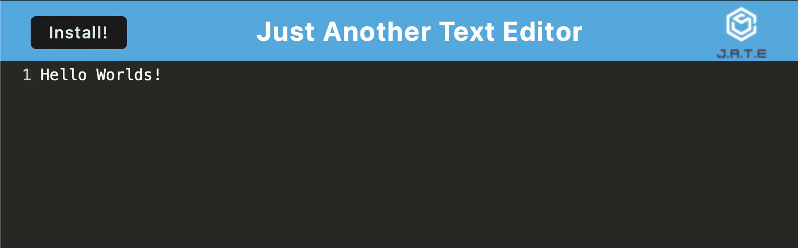

# JOT-PWA


## Description

A PWA text editor that support syntax highlighting using `codemirror`. There are no installation instructions and feel free to navigate to the link below for the deployed version!

This text editor uses a client-side db IDB (indexDB) to store the information.

[Click here for the deployed site!](https://jot-pwa.herokuapp.com)

## Usage

If you are interested in hosting this PWA on you local machine, feel free to clone this repository to your local machine, and you can run the following npm command to start:

``` bash
    npm run star:dev
```

and webpack will bundle all the necessary files, start a mock server using `webpack-dev-server`, and starts the `server.js` concurrently!

On your local machine, you should now be able to navigate to `localhost://8080` and interact with your text editor

## Demo Link / Media
*(feel free to click on the image below to go to the **deployed version** hosted on Heroku!)*

[](https://jot-pwa.herokuapp.com)


## License

Licensed under the MIT license.
[License details here](https://opensource.org/licenses/MIT)

## Technologies Used
> JavaScript

> node.js

> express.js

> iDB (indexDB)

> webpack

> codeMirror

## Authors

[](https://github.com/DraconMarius)
[](https://www.linkedin.com/in/mari-ma-70771585/)

[Icon credit @ Anton Kalashnyk](https://icon-icons.com/users/14quJ7FM9cYdQZHidnZoM/icon-sets/)

## Contributing Guidlines

If you would like to contribute to this app, please contact me on the above links and we can discuss further.

## Questions

For any questions, please reach out by creating an issue.
